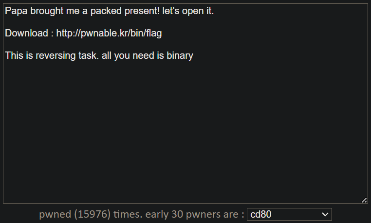
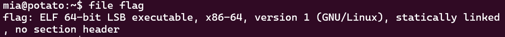
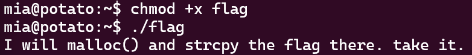
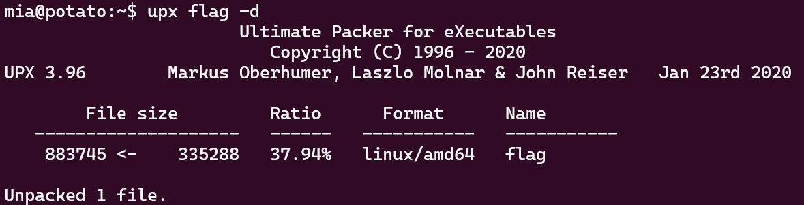
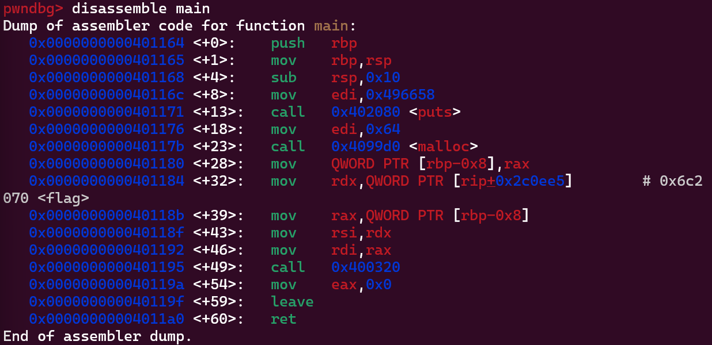
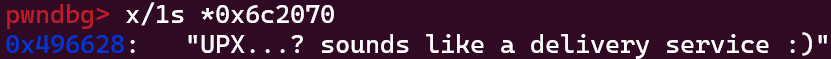

wget으로 받아서 실행했다.


이렇게 생긴 파일이다.



`I will malloc() and strcpy the flag there. take it.`


### packed

"packed"라는 단어가 수상해서 검색해보니,
packed executable에서 모든 데이터나 코드가 압축되는 것이 아니고 몇몇은 바뀌지 않은 채 남아있어 unpacking routine에서 recognizable signature가 된다고 한다.

주어진 파일에서 printable 문자열을 추출하는 strings 명령어를 사용했다.

`$ strings flag`

엄청나게 긴 출력이 나왔는데, 그중 눈에 띄는 게 있었다.
```
$Info: This file is packed with the UPX executable packer http://upx.sf.net $
$Id: UPX 3.08 Copyright (C) 1996-2011 the UPX Team. All Rights Reserved. $
```

`$ strings flag | grep packed`
위 명령어로 찾아도 된다.

읽어보니 UPX executable packer로 packed되었다고 한다.


### UPX

Ultimate Packer for eXecutables라는 실행파일을 압축하는 프로그램이라고 한다.
다운받았다.

```
$ sudo apt update
$ sudo apt install upx
```

압축해제 커맨드는 다음과 같다.

`$ upx -d flag`



gdb로 main을 disassemble해준다.



이상한 주석이 있다.
0x6c2070에 있는 값을 출력한다.
`(gdb) x/1s *0x6c2070`



🚩