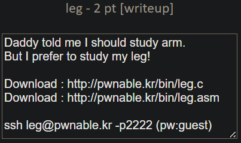
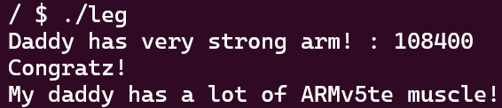

```c
#include <stdio.h>
#include <fcntl.h>
int key1(){
	asm("mov r3, pc\n");
}
int key2(){
	asm(
	"push	{r6}\n"
	"add	r6, pc, $1\n"
	"bx	r6\n"
	".code   16\n"
	"mov	r3, pc\n"
	"add	r3, $0x4\n"
	"push	{r3}\n"
	"pop	{pc}\n"
	".code	32\n"
	"pop	{r6}\n"
	);
}
int key3(){
	asm("mov r3, lr\n");
}
int main(){
	int key=0;
	printf("Daddy has very strong arm! : ");
	scanf("%d", &key);
	if( (key1()+key2()+key3()) == key ){
		printf("Congratz!\n");
		int fd = open("flag", O_RDONLY);
		char buf[100];
		int r = read(fd, buf, 100);
		write(0, buf, r);
	}
	else{
		printf("I have strong leg :P\n");
	}
	return 0;
}
```

key1, key2, key3의 리턴값을 더해서 입력하면 flag를 알 수 있다.

#### key1

```
(gdb) disass key1
Dump of assembler code for function key1:
   0x00008cd4 <+0>:	    push	{r11}		; (str r11, [sp, #-4]!)
   0x00008cd8 <+4>:	    add	    r11, sp, #0
   0x00008cdc <+8>:	    mov	    r3, pc
   0x00008ce0 <+12>:    mov	    r0, r3
   0x00008ce4 <+16>:	sub	    sp, r11, #0
   0x00008ce8 <+20>:	pop	    {r11}		; (ldr r11, [sp], #4)
   0x00008cec <+24>:	bx	    lr
End of assembler dump.
```

pc 값을 r3 레지스터에 넣고, r3의 값을 r0 레지스터에 넣는다.
이때, 함수가 반환할 값은 r0에 저장되므로, 리턴값은 pc 값과 같다.

pc는 현재 명령어 주소+8이므로, 0x00008ce4이다.

key1 = 0x00008ce4

#### key2

```
(gdb) disass key2
Dump of assembler code for function key2:
   0x00008cf0 <+0>:	    push	{r11}		; (str r11, [sp, #-4]!)
   0x00008cf4 <+4>: 	add	    r11, sp, #0
   0x00008cf8 <+8>:	    push	{r6}		; (str r6, [sp, #-4]!)
   0x00008cfc <+12>:	add  	r6, pc, #1
   0x00008d00 <+16>:	bx	    r6
   0x00008d04 <+20>:	mov	    r3, pc
   0x00008d06 <+22>:	adds	r3, #4
   0x00008d08 <+24>:	push	{r3}
   0x00008d0a <+26>:	pop	    {pc}
   0x00008d0c <+28>:	pop	    {r6}		; (ldr r6, [sp], #4)
   0x00008d10 <+32>:	mov	    r0, r3
   0x00008d14 <+36>:	sub	    sp, r11, #0
   0x00008d18 <+40>:	pop	    {r11}		; (ldr r11, [sp], #4)
   0x00008d1c <+44>:	bx	    lr
End of assembler dump.
```

key2에서도, pc 값을 r3에 저장하고 r3값에 0x4를 더한 후 r0에 저장한다.

key2 = 0x00008d08+0x4 = 0x00008d0c

#### key3

```
(gdb) disass key3
Dump of assembler code for function key3:
   0x00008d20 <+0>:	    push	{r11}		; (str r11, [sp, #-4]!)
   0x00008d24 <+4>:	    add	    r11, sp, #0
   0x00008d28 <+8>:	    mov	    r3, lr
   0x00008d2c <+12>:	mov	    r0, r3
   0x00008d30 <+16>:	sub 	sp, r11, #0
   0x00008d34 <+20>:	pop	    {r11}		; (ldr r11, [sp], #4)
   0x00008d38 <+24>:	bx	    lr
End of assembler dump.
```

key3은 lr 레지스터의 값을 r3에 저장하고, r3 값을 r0에 저장한다.

lr 레지스터는 함수 호출 시, 호출된 함수가 종료된 후 돌아갈 주소를 저장한다.
main을 디스어셈블한 결과를 보자.

```
0x00008d7c <+64>:	bl	0x8d20 <key3>
0x00008d80 <+68>:	mov	r3, r0
```

key3 함수의 실행이 끝나고 돌아가는 명령어의 주소는 0x00008d80이다.

key3= 0x00008d80

#### key

0x00008ce4 + 0x00008d0c + 0x00008d80 = 108400

정수값으로 입력을 받기 때문에 10진수 값으로 입력한다.



🚩