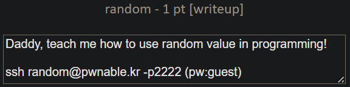
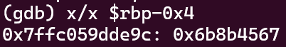
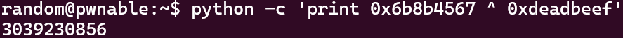
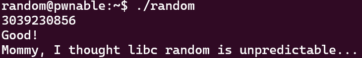

`random.c` 파일을 읽어보자.

```c
#include <stdio.h>

int main(){
        unsigned int random;
        random = rand();        // random value!

        unsigned int key=0;
        scanf("%d", &key);

        if( (key ^ random) == 0xdeadbeef ){
                printf("Good!\n");
                system("/bin/cat flag");
                return 0;
        }

        printf("Wrong, maybe you should try 2^32 cases.\n");
        return 0;
}
```

`rand()` 함수로 생성된 난수값인 `random`과 입력값 `key`를 XOR 연산한다.
결과가 `0xdeadbeef`이면 `system` 함수를 실행한다.

`rand()` 함수는 프로그램을 실행할 때마다 항상 같은 난수를 생성한다는 취약점이 있다고 한다.

그럼 생성된 난수가 어딘가에 저장되어 있을 것 같다.


main+56에서 `eax`와 `-0x4(%rbp)`를 XOR 연산하고, main+59에서 `0xdeadbeef`와 `eax`를 비교하는 것을 확인했다.

`-0x8(%rbp)`에는 `key` 값, `-0x4(%rbp)`에는 `random` 값이 저장되어 있는 것 같다.

breakpoint를 main+43에 걸고 실행한 뒤 `$rbp-0x4`의 값을 확인했다.



`0x6b8b4567`이 `random`의 값이다.
`random`과 XOR 연산해서 `0xdeadbeef`가 나오는 값을 파이썬 연산으로 찾아보자.



다시 `./random`을 실행하고 입력값으로 3039230856을 준다.



🚩